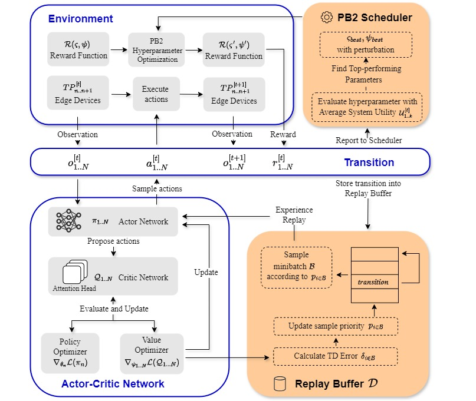

# ATLA — Adaptive Transformer-based Learning Algorithm  
*A scalable MARL framework for resource-adaptive video streaming in cloud–edge–end systems.*

ATLA combines a **Transformer-based centralized critic**, **prioritized experience replay**, and **Population-Based Bandit (PB2)** hyper-parameter tuning to jointly optimize **adaptive video compression, cooperative offloading, resource allocation, and incentive distribution** in dynamic wireless environments.

  

---

## Key Features
* **Transformer Critic** – captures long-range inter-agent dependencies for better global coordination.  
* **Prioritized Replay (PER)** – focuses learning on high-impact transitions.  
* **PB2 Hyper-parameter Scheduler** – automatically tunes penalty weights (time vs. accuracy) during training.  
* **Blockchain-ready Incentives** – smart-contract scripts for trustless reward distribution.  

